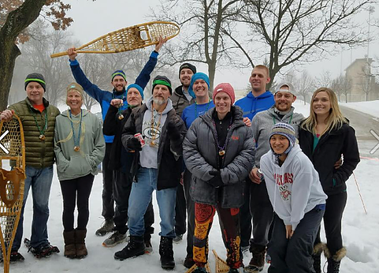

# ABOUT US

## WELCOME
Welcome to the home of the Eau Claire Hash House Harriers (ECH3)!! We are a social club that meets weekly to run or walk through the Chippewa Valley's streets, alleys, trails, forests, and parks. Here you will find everything you need to take part in the Eau Claire chapter of the world’s largest drinking club with a running problem.

Every Friday, we meet at a Chippewa Valley bar to socialize and have fun, with or without as much beer and/or running as you'd like. Participants include a wide range of ages and we welcome anyone to join us.

### Runners
We take part in a group run on a 3 – 5 mile course that’s been chosen by one of the members. The pace is variable based upon a consensus by the hashers and usually between a 8:00 and 10:00 minute/miles. It is not a race and we often take several breaks to take in the beauties of Northwest Wisconsin. We hash rain or sun, sleet or snow, hot or cold. Many hashers arrive between 5:00 and 5:30 p.m. to have a pint or two before hashing around 6pm. If you are coming for the first time, and insist on being five minutes early, don’t worry, someone will likely be there eventually.

### Walkers
Most likely you can find someone to go on a walk if you do not wish to take part in the run. This is a newer group so spread the word!  

### Everyone Else
A good amount of friends often stay behind to continue enjoying the specials at the watering hole. 

Each Friday we gather is a routine but unique experience! When the runners return to hydrate, we often stay and continue to visit, take part in any of the bar games or board/card/party games that people have brought, or get dinner and keep the good times rolling! You can expect a "typical" Friday hash to end anywhere between 6:00 p.m. and 6:00 a.m. 

Come and check us out!

#onon #ECH3

