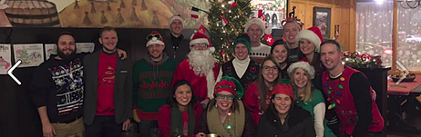

# HASHING 101

Hashing . . . a mixture of exercise, tomfoolery, and delicious beverages. It combines running, orienteering, and partying!

Hashing began in Kuala Lumpur, Malaysia, in 1938, when a group of British colonial officials and expatriates founded a running club called the Hash House Harriers. They named the group after their meeting place, the Selangor Club, nicknamed the “Hash House.” Hash House Harrier runs were patterned after the traditional British paper chase. A “hare” was given a head start to blaze a trail, marking his devious way with shreds of paper, all the while pursued by a shouting pack of “harriers.” Only the hare knew where he was going . . . the harriers followed his clues to stay on trail. Apart from the excitement of chasing the hare and solving the clues, reaching the end was its own reward . . . for there, thirsty harriers would find a tub of ice cold beer.

