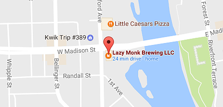
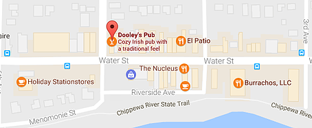
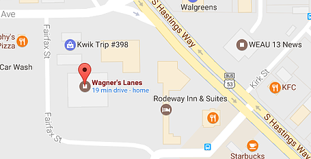
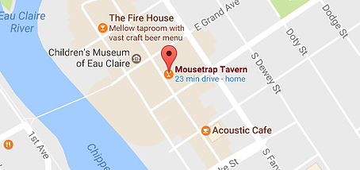

# WEEKLY HASHES

## HOW DO I HASH?
Just show up ready to run (or walk, or just hang out) at the weekly bar.  We hash rain or sun, sleet or snow, hot or cold. Most hashers arrive between 5:00 and 5:30 p.m. in time to have a pint or two before hashing at 6:00 p.m. If you are coming for the first time, and insist on being five minutes early, don’t worry, someone will likely be there eventually. If you don't feel like running, we offer a new walking group and often a few of us stay behind to continue enjoying our specials at the watering hole or play games.

## LAZY MONK BREWING
* 1st Friday of the Month
* Special: $1 off first beer
* 

## DOOLEY'S PUB
* 2nd Friday of the Month
* Special: 1/2 off appetizers
* 

## WAGNER'S LANES / THE COMPLEXX
* 3rd Friday of the Month
* Special: Free pizza with every 6 hashers
* 

## THE MOUSE TRAP
* 4th Friday of the Month
* Special: $1 off all domestic beers
* 

## "Mystery" Bar
* 5th Friday of the Month
* Location determined through popular vote on Facebook during preceding week. Hash route determined by individual that suggested winning bar.
* 
